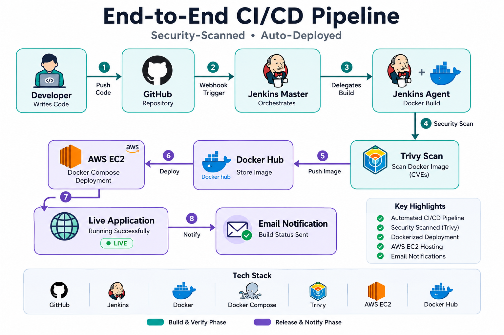

🚀 End-to-End DevOps CI/CD Pipeline for EasyShop on AWS

📌 Project Overview

This repository showcases an end-to-end DevOps CI/CD pipeline built for
the EasyShop e-commerce application.

The pipeline automates the software delivery lifecycle by integrating
GitHub, Jenkins, Docker, Trivy, Docker Hub, and AWS EC2.

🏗️ Architecture

Replace with your architecture image:

🛠️ Tech Stack

-   Git & GitHub
-   Jenkins
-   Docker
-   Docker Compose
-   Docker Hub
-   Trivy
-   AWS EC2
-   Ubuntu Linux

🔄 CI/CD Workflow

1.  Developer pushes code to GitHub.
2.  GitHub Webhook triggers Jenkins.
3.  Jenkins clones the repository.
4.  Docker builds the image.
5.  Trivy scans the filesystem and Docker image.
6.  Docker image is pushed to Docker Hub.
7.  Docker Compose deploys the latest image on AWS EC2.
8.  Jenkins sends email notifications.

✨ Features

-   Automated CI/CD Pipeline
-   GitHub Webhook Integration
-   Custom Dockerfile
-   Custom Docker Compose
-   Jenkins Pipeline
-   Trivy Security Scanning
-   Docker Hub Integration
-   AWS EC2 Deployment
-   Email Notifications

📚 Learning Outcomes

-   Jenkins Pipelines
-   Docker
-   Docker Compose
-   Trivy
-   Docker Hub
-   AWS EC2
-   Linux
-   CI/CD
-   DevSecOps

🚀 Future Enhancements

-   SonarQube
-   Kubernetes
-   Terraform
-   Prometheus
-   Grafana
-   Argo CD

🙏 Credits

This project uses the open-source EasyShop application as the deployment
target.

Original Repository: https://github.com/iemafzalhassan/easyshop

My contribution includes: - Custom Dockerfile - Custom Docker Compose -
Jenkins Pipeline - GitHub Webhook Integration - Trivy Integration -
Docker Hub Integration - AWS EC2 Deployment - Email Notifications

👨‍💻 Author

Shivam Atre
